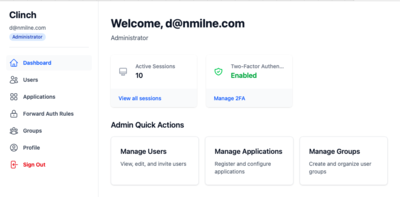
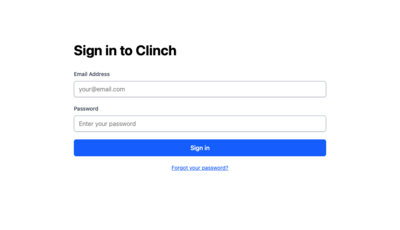
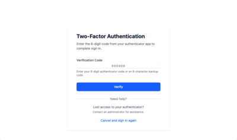
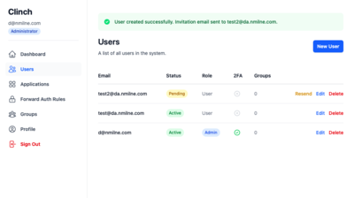
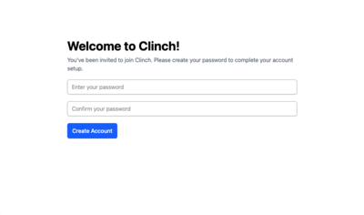
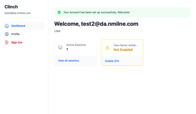
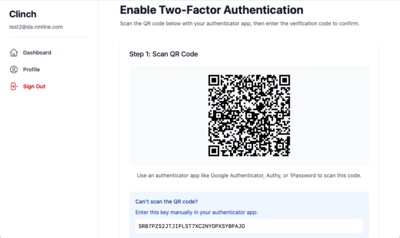
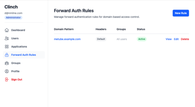
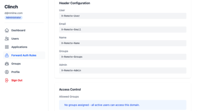

# Clinch

> [!NOTE]
> This software is experiemental. If you'd like to try it out, find bugs, security flaws and improvements, please do. 

**A lightweight, self-hosted identity & SSO / IpD portal**

Clinch gives you one place to manage users and lets any web app authenticate against it without maintaining its own user table. 

I've completed all planned features: 

* Create Admin user on first login
* TOTP ( QR Code ) 2FA, with backup codes ( encrypted at rest )
* Passkey generation and login, with detection of Passkey during login
* Forward Auth configured and working
* OIDC provider with auto discovery working
* Invite users by email, assign to groups
* Self managed password reset by email
* Use Groups to assign Applications ( Family group can access Kavita, Developers can access Gitea )
* Configurable Group and User custom claims for OIDC token
* Display all Applications available to the user on their Dashboard
* Display all logged in sessions and OIDC logged in sessions

What remains now is ensure test coverage, 

## Why Clinch?

Do you host your own web apps? MeTube, Kavita, Audiobookshelf, Gitea? Rather than managing all those separate user accounts, set everyone up on Clinch and let it do the authentication and user management.

Clinch sits in a sweet spot between two excellent open-source identity solutions:

**[Authelia](https://www.authelia.com)** is a fantastic choice for those who prefer external user management through LDAP and enjoy comprehensive YAML-based configuration. It's lightweight, secure, and works beautifully with reverse proxies.

**[Authentik](https://goauthentik.io)** is an enterprise-grade powerhouse offering extensive protocol support (OAuth2, SAML, LDAP, RADIUS), advanced policy engines, and distributed "outpost" architecture for complex deployments.

**Clinch** offers a middle ground with built-in user management, a modern web interface, and focused SSO capabilities (OIDC + ForwardAuth). It's perfect for users who want self-hosted simplicity without external dependencies or enterprise complexity.

---

## Screenshots

### User Dashboard
[](docs/screenshots/0-dashboard.png)

### Sign In
[](docs/screenshots/1-signin.png)

### Sign In with 2FA
[](docs/screenshots/2-signin.png)

### Users Management
[](docs/screenshots/3-users.png)

### Welcome Screen
[](docs/screenshots/4-welcome.png)

### Welcome Setup
[](docs/screenshots/5-welcome-2.png)

### Setup 2FA
[](docs/screenshots/6-setup-2fa.png)

### Forward Auth Example 1
[](docs/screenshots/7-forward-auth-1.png)

### Forward Auth Example 2
[](docs/screenshots/8-forward-auth-2.png)

## Features

### User Management
- **First-run wizard** - Initial user automatically becomes admin
- **Admin dashboard** - Create, disable, and delete users
- **Group-based organization** - Organize users into groups (admin, family, friends, etc.)
- **User statuses** - Active, disabled, or pending invitation

### Authentication Methods
- **Password authentication** - Secure bcrypt-based password storage
- **Magic login links** - Passwordless login via email (15-minute expiry)
- **TOTP 2FA** - Optional time-based one-time passwords with QR code setup
- **Backup codes** - 10 single-use recovery codes per user
- **Configurable 2FA enforcement** - Admins can require TOTP for specific users/groups

### SSO Protocols

#### OpenID Connect (OIDC)
Standard OAuth2/OIDC provider with endpoints:
- `/.well-known/openid-configuration` - Discovery endpoint
- `/authorize` - Authorization endpoint
- `/token` - Token endpoint
- `/userinfo` - User info endpoint

Client apps (Audiobookshelf, Kavita, Grafana, etc.) redirect to Clinch for login and receive ID tokens and access tokens.

#### Trusted-Header SSO (ForwardAuth)
Works with reverse proxies (Caddy, Traefik, Nginx):
1. Proxy sends every request to `/api/verify`
2. **200 OK** → Proxy injects headers (`Remote-User`, `Remote-Groups`, `Remote-Email`) and forwards to app
3. **401/403** → Proxy redirects to Clinch login; after login, user returns to original URL

Apps that speak OIDC use the OIDC flow; apps that only need "who is it?" headers use ForwardAuth.

**Note:** ForwardAuth requires applications to run on the same domain as Clinch (e.g., `app.yourdomain.com` with Clinch at `auth.yourdomain.com`) for secure session cookie sharing. Take a look at Authentik if you need multi domain support.

### SMTP Integration
Send emails for:
- Invitation links (one-time token, 7-day expiry)
- Password reset links (one-time token, 1-hour expiry)
- 2FA backup codes

### Session Management
- **Device tracking** - See all active sessions with device names and IPs
- **Remember me** - Long-lived sessions (30 days) for trusted devices
- **Session revocation** - Users and admins can revoke individual sessions

### Access Control
- **Group-based allowlists** - Restrict applications to specific user groups
- **Per-application access** - Each app defines which groups can access it
- **Automatic enforcement** - Access checks during OIDC authorization and ForwardAuth
- **Custom claims** - Add arbitrary claims to OIDC tokens via groups and users (perfect for app-specific roles)

---

## Data Model

### Core Models

**User**
- Email address (unique, normalized to lowercase)
- Password (bcrypt hashed)
- Admin flag
- TOTP secret and backup codes (encrypted)
- TOTP enforcement flag
- Status (active, disabled, pending_invitation)
- Custom claims (JSON) - arbitrary key-value pairs added to OIDC tokens
- Token generation for invitations, password resets, and magic logins

**Group**
- Name (unique, normalized to lowercase)
- Description
- Custom claims (JSON) - shared claims for all members (merged with user claims)
- Many-to-many with Users and Applications

**Session**
- User reference
- IP address and user agent
- Device name (parsed from user agent)
- Remember me flag
- Expiry (24 hours or 30 days if remembered)
- Last activity timestamp

**Application**
- Name and slug (URL-safe identifier)
- Type (oidc or forward_auth)
- Client ID and secret (for OIDC apps)
- Redirect URIs (for OIDC apps)
- Domain pattern (for ForwardAuth apps, supports wildcards like *.example.com)
- Headers config (for ForwardAuth apps, JSON configuration for custom header names)
- Metadata (flexible JSON storage)
- Active flag
- Many-to-many with Groups (allowlist)

**OIDC Tokens**
- Authorization codes (10-minute expiry, one-time use)
- Access tokens (1-hour expiry, revocable)

---

## Authentication Flows

### OIDC Authorization Flow
1. Client redirects user to `/authorize` with client_id, redirect_uri, scope
2. User authenticates with Clinch (username/password + optional TOTP)
3. Access control check: Is user in an allowed group for this app?
4. If allowed, generate authorization code and redirect to client
5. Client exchanges code for access token at `/token`
6. Client uses access token to fetch user info from `/userinfo`

### ForwardAuth Flow
1. User requests protected resource at `https://app.example.com/dashboard`
2. Reverse proxy sends request to Clinch at `/api/verify`
3. Clinch checks for valid session cookie
4. If valid session and user allowed:
   - Return 200 with `Remote-User`, `Remote-Groups`, `Remote-Email` headers
   - Proxy forwards request to app with injected headers
5. If no session or not allowed:
   - Return 401/403
   - Proxy redirects to Clinch login page
   - After login, redirect back to original URL

---

## Setup & Installation

### Requirements
- Ruby 3.3+
- SQLite 3.8+
- SMTP server (for sending emails)

### Local Development

```bash
# Install dependencies
bundle install

# Setup database
bin/rails db:setup

# Run migrations
bin/rails db:migrate

# Start server
bin/dev
```

### Docker Deployment

```bash
# Build image
docker build -t clinch .

# Run container
docker run -p 3000:3000 \
  -v clinch-storage:/rails/storage \
  -e SECRET_KEY_BASE=your-secret-key \
  -e SMTP_ADDRESS=smtp.example.com \
  -e SMTP_PORT=587 \
  -e SMTP_USERNAME=your-username \
  -e SMTP_PASSWORD=your-password \
  clinch
```

---

## Configuration

### Environment Variables

Create a `.env` file (see `.env.example`):

```bash
# Rails
SECRET_KEY_BASE=generate-with-bin-rails-secret
RAILS_ENV=production

# Database
# SQLite database stored in storage/ directory (Docker volume mount point)

# SMTP (for sending emails)
SMTP_ADDRESS=smtp.example.com
SMTP_PORT=587
SMTP_DOMAIN=example.com
SMTP_USERNAME=your-username
SMTP_PASSWORD=your-password
SMTP_AUTHENTICATION=plain
SMTP_ENABLE_STARTTLS=true

# Application
CLINCH_HOST=https://auth.example.com
CLINCH_FROM_EMAIL=noreply@example.com
```

### First Run
1. Visit Clinch at `http://localhost:3000` (or your configured domain)
2. First-run wizard creates initial admin user
3. Admin can then:
   - Create groups
   - Invite users
   - Register applications
   - Configure access control

---

## Roadmap

### In Progress
- OIDC provider implementation
- ForwardAuth endpoint
- Admin UI for user/group/app management
- First-run wizard

### Planned Features
- **Audit logging** - Track all authentication events
- **WebAuthn/Passkeys** - Hardware key support

#### Maybe
- **SAML support** - SAML 2.0 identity provider
- **Policy engine** - Rule-based access control
  - Example: `IF user.email =~ "*@gmail.com" AND app.slug == "kavita" THEN DENY`
  - Stored as JSON, evaluated after auth but before consent
- **LDAP sync** - Import users from LDAP/Active Directory

---

## Technology Stack

- **Rails 8.1** - Modern Rails with authentication generator
- **SQLite** - Lightweight database (production-ready with Rails 8)
- **Tailwind CSS** - Utility-first styling
- **Hotwire** - Turbo and Stimulus for reactive UI
- **ROTP** - TOTP implementation for 2FA
- **bcrypt** - Password hashing

---

## License

MIT